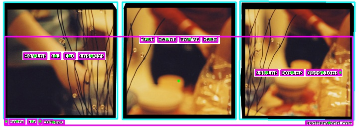

# A Softer World Text Analysis

## Background

*A Softer World* was a webcomic that ran from 2003 to 2015. Its format was
similar to common three-panel comics, with short text superimposed over still
photographs.

My subjective experience while following *A Softer World* during its run was
that the breaks between panels often seemed to be counter-intuitive,
occurring within major constituent phrases rather than at their boundaries.

## Objective

The goal of this project is to analyze and quantify how the text's sentences
were split between panels, as compared to boundaries between syntactic
constituents, and to assess whether my subjective impression is consistent with
the actual pattern present in A Softer World.

## Current Progress

Individual comics are scraped from *A Softer World* using BeautifulSoup.
OpenCV and Google Vision OCR are used to identify the boundaries of individual
comic frames and the text within them.

## Example of Usage

```python
import asw
c = asw.Comic(869)
print(c)
```
```
Retrieving html from https://www.asofterworld.com/index.php?id=869
comics/0869_query.jpg already exists. Skipping download.
Calling Google Vision OCR

    id:              869
    url:             https://www.asofterworld.com/index.php?id=869
    img_url:         https://www.asofterworld.com/clean/query.jpg
    filename:        query.jpg
    hover:           the freedom of uncertainty.
    local_img_path:  comics/0869_query.jpg
    panel_text:      Having all the answers
                     just means means you've been
                     asking boring questions .
```
```python
c.draw_panel_contours()
c.draw_textbox_outlines()
c.draw_ocr_text()
c.show_img()
```



## Next Steps

The future plan is to make use of NLP tools to parse the syntactic structure of
the text to identify consituent boundaries. The apparent [constituency-parsing
capabilities of Stanza](https://stanfordnlp.github.io/stanza/constituency.html)
make it an initial candidate.

Once constituency structure can be parsed, then compare and quantify the major
syntactic boundaries to syntactic breaks between frames, and finally visualize
quantified findings.
