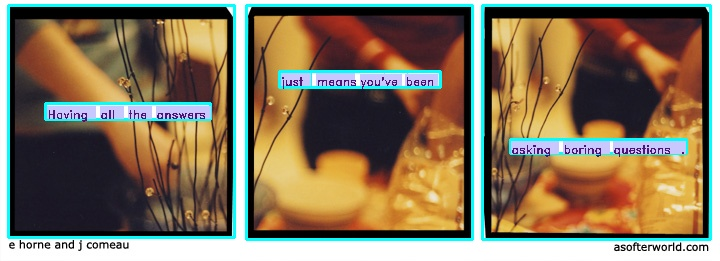

# A Softer World Text Analysis

## Background

A Softer World was a webcomic that ran from 2003 to 2015. Its format was
similar to common three-panel comics, with short text superimposed over still
photographs.

My subjective experience while following A Softer World during its run was that
the breaks between panels often seemed to be counter-intuitive, occurring within
major constituent phrases rather than at their boundaries.

## Objective

The goal of this project is to analyze and quantify how the text's sentences
were split between panels, as compared to boundaries between syntactic
constituents, and to assess whether my subjective impression is consistent with
the actual pattern present in A Softer World.

## Current Progress

Each comic image, along with information from each (title, number, alt-text) is
collected with use of the Beautiful Soup package. OpenCV and Google Vision OCR
are used to identify the boundaries of individual comic frames and the text
within them:

Note that the footer text below the frames are outside of the frames'
boundaries in cyan (the reference point for the text is the green dot). The
footer text is thus excluded due to not being contained within any frame.

## Next Steps

The future plan is to make use of NLP tools to parse the syntactic structure of
the text to identify consituent boundaries. The apparent [constituency-parsing
capabilities of Stanza](https://stanfordnlp.github.io/stanza/constituency.html)
make it an initial candidate.

Once constituency structure can be parsed, then compare and quantify the major
syntactic boundaries to syntactic breaks between frames, and finally visualize
quantified findings.
